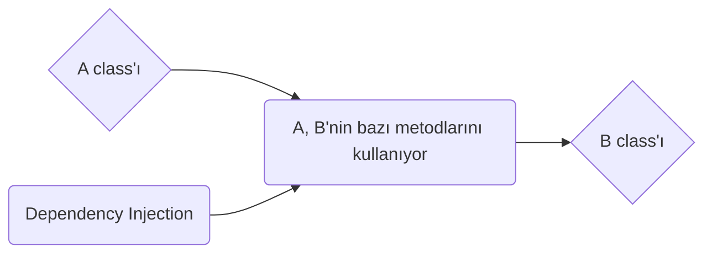

# Dependency Injection

## Dependency Injection Nedir
Dependency Injection(Bağımlılık Enjeksiyonu) birbirine bağlı olan sınıfların/modellerin/nesnelerin bağlılıklarını soyutlamayı amaçlayan bir programlama prensibidir. Bu prensip ile bir sınıfın bağımlı olduğu nesneden bağımsız hareket edebilmesi yani kod üzerinde bir geliştirme yapıldığında değişiklik yapma ihtiyacının ortadan kaldırılması hedeflenir.

Dependency Injection herhangi bir programlama dilinde uygulanabilir ve arkasındaki ana konsept Inversion of Control(IoC) olarak adlandırılır.

Genel olarak 3 farklı dependency injection şekli vardır. Bunlar: Constructor Injection, Setter Injection, Method Injection. Bu tüm yöntemler bağımlı olan sınıfları dışarıdan enjekte etmeye dayanır.

## Dependency Injection Kullanmanın Avantajları

Java'da diğer sınıfların yöntemlerini kullanmadan önce, o sınıfın nesnesini yaratmamız(new) gerekmektedir. Bu prensip ile yapılan yazılımlarda nesneyi oluşturma görevi devredilir ve doğrudan bağımlılık ortadan kaldırılır.

1. Bir metodun implementasyonundan izle bir şekilde çalıştırılabilmesini sağlar.
2.  Farklı implementasyonlar arasında, kolayca geçiş yapabilmenizi sağlar.
3.  Program modülerliğini artırır.
4.  Bağımlılıklar en aza indiği için test etmeyi/yazmayı kolaylaştırır.

### Loosely Coupled

Loosely Coupled'ı dilimizde Gevşek Bağlılık olarak adlandırılabilir. Yazılımı oluşturan yapıların bir biriyle ilişkili olmaması beklenemez fakat bu ilişkinin bir bağımlılığa, yapıların birbirini sınırlandırmasına sebep olmaması için bu ilişkiyi olabildiğince gevşek tutmak önemlidir. Bu şekilde yazılımda olası bir değişiklikte yeni özelliklerin eklenip çıkarılması çok daha kolay hale gelir.

## Dependency Injection Sağlayan  Framework ve Kütüphaneler
-   [Spring](https://www.tutorialspoint.com/spring/spring_dependency_injection.htm) (Java)
-   [Google Guice](https://github.com/google/guice)  (Java)
-   [Dagger](http://square.github.io/dagger/) (Java and Android)
-   [Castle Windsor](https://github.com/castleproject/Windsor)  (.NET)
-   [Unity](https://www.microsoft.com/en-us/download/details.aspx?id=39944)(.NET)

## Neden Dependency Injection Kullanmalıyız?
Bir örnek vermek gerekirse içinde farklı objeler bulunan bir araba nesnemizin olduğunu varsayalım. Bu objeler renk, marka ve benzeri şeklinde olsun. İleride artık A markası arabaları kullanmak yerine B markası arabaları kullanmak istersek araba objesini tekrardan B markasına uygun şekilde revize etmemiz gerekir. Fakat dependency injection kullanıyorsak bu işlemi 2 nesneden bağımsız bir şekilde kolayca yapabiliriz. Araba sınıfını oluşturmak artık markadan, renkten bağımsız hale gelir.

